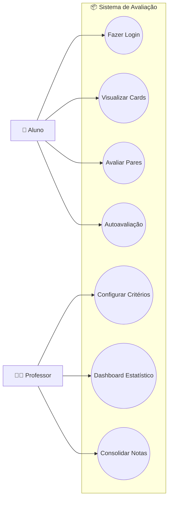
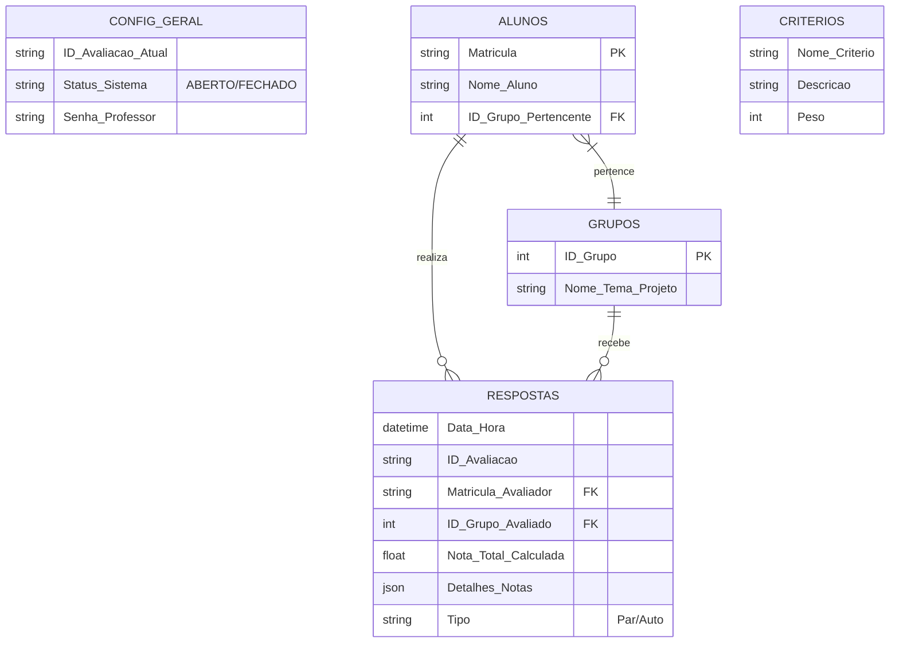

# 🎓 Sistema de Avaliação por Pares (Peer Review)

[](https://streamlit.io)
[](https://python.org)
[](https://www.google.com/sheets/about/)

Uma aplicação web Full Stack para gerenciamento de avaliações acadêmicas em tempo real. O sistema permite que alunos avaliem apresentações de colegas (avaliação por pares) e realizem autoavaliação através de uma interface gamificada baseada em cards. O professor possui um dashboard estatístico para análise de desempenho, detecção de notas discrepantes (outliers) e fechamento de notas consolidadas.

-----

## 🚀 Funcionalidades Principais

### Para o Aluno

  * **Login Simples:** Acesso via número de matrícula.
  * **Interface Visual:** Seleção de grupos através de Cards Interativos.
  * **Feedback Visual:** Cards mudam de cor (✅ Concluído / 🟦 Autoavaliação / ⬜ Pendente).
  * **Avaliação Dinâmica:** Critérios personalizáveis com escala Likert (1 a 5).
  * **Segurança:** Bloqueio automático de votos duplicados.

### Para o Professor

  * **Gestão via Planilha:** Toda a configuração (Alunos, Grupos, Critérios) é feita no Google Sheets.
  * **Dashboard Estatístico:** Ranking em tempo real com cálculo de média, desvio padrão e contagem de votos.
  * **Consolidação de Notas:** Botão "One-Click" que calcula a nota final de cada aluno e exporta para uma nova aba na planilha, mantendo histórico (ex: `Notas_Seminario_1`).
  * **Reutilização:** O sistema suporta múltiplos eventos/avaliações ao longo do semestre.

-----

## 🛠️ Arquitetura e UML

O sistema utiliza uma arquitetura *Serverless-like* onde o **Python (Streamlit)** atua como Frontend e Backend lógico, enquanto o **Google Sheets** atua como Banco de Dados e Painel de Configuração.

### Diagrama de Casos de Uso

Este diagrama ilustra as interações dos atores (Aluno e Professor) com o sistema.



### Diagrama de Entidades (Banco de Dados)

A estrutura de dados é relacional e armazenada em abas do Google Sheets.



-----

## 📦 Instalação e Configuração

### Pré-requisitos

  * Conta no Google Cloud Platform (para gerar a API Key).
  * Planilha no Google Sheets.
  * Python 3.8+.

### 1\. Configuração da Planilha (Google Sheets)

Crie uma planilha com as seguintes abas (respeite as letras maiúsculas):

1.  **`CONFIG_GERAL`**: Colunas `ID_Avaliacao_Atual`, `Status_Sistema`, `Senha_Professor`.
2.  **`ALUNOS`**: Colunas `Matricula`, `Nome_Aluno`, `ID_Grupo_Pertencente`.
3.  **`GRUPOS`**: Colunas `ID_Grupo`, `Nome_Tema_Projeto`.
4.  **`CRITERIOS`**: Colunas `Nome_Criterio`, `Descricao`, `Peso`.
5.  **`RESPOSTAS`**: Apenas cabeçalho (vazio).
6.  **`NOTAS`**: Apenas cabeçalho (vazio).

### 2\. Execução Local

```bash
# Clone o repositório
git clone https://github.com/SEU_USUARIO/NOME_DO_REPO.git

# Instale as dependências
pip install -r requirements.txt

# Configure as credenciais
# Coloque seu arquivo 'creds.json' do Google Cloud na raiz do projeto.

# Execute a aplicação
streamlit run app.py
```

### 3\. Deploy na Nuvem (Streamlit Cloud)

1.  Suba o código no GitHub (NÃO suba o arquivo `creds.json`).
2.  Conecte sua conta no [Streamlit Cloud](https://share.streamlit.io/).
3.  Nas configurações do App, vá em **Secrets** e cole o conteúdo do seu JSON no formato TOML:

<!-- end list -->

```toml
[gcp_service_account]
type = "service_account"
project_id = "seu-id"
# ... resto das credenciais ...
```

-----

## 🆘 HELP / Guia de Uso

### 👨‍🏫 Para o Professor

#### Como iniciar uma nova avaliação?

1.  Abra sua Planilha Google na aba **`CONFIG_GERAL`**.
2.  Na linha 2, defina o **Nome do Evento** (ex: `Seminario_Bio`) e mude o Status para **`ABERTO`**.
3.  Cadastre os alunos na aba `ALUNOS` e os temas na aba `GRUPOS`.
4.  Defina o que será avaliado na aba `CRITERIOS` (ex: Oratória, Peso 2).

#### Como encerrar e gerar notas?

1.  Acesse o sistema pela **Área do Professor** (use a senha definida na planilha).
2.  Clique em **"Atualizar Dados"** para ver o ranking final.
3.  Verifique a tabela "Prévia das Notas Finais".
4.  Clique no botão **"💾 Salvar Notas de 'Seminario\_Bio'"**.
      * *O sistema criará automaticamente uma aba chamada `Notas_Seminario_Bio` na sua planilha com as médias finais.*
5.  Volte na planilha (`CONFIG_GERAL`) e mude o status para **`FECHADO`**.

-----

### 🧑‍🎓 Para o Aluno

#### Como entrar?

1.  Selecione **"Área do Aluno"** no menu lateral.
2.  Digite seu número de matrícula.

#### Como avaliar?

1.  Você verá vários **Cartões (Cards)** na tela. Cada cartão é um grupo.
2.  Clique no cartão do grupo que está apresentando agora (Botão Branco ⬜).
      * *Nota: Se for o seu grupo, o botão será Azul 🟦 (Autoavaliação).*
3.  Dê uma nota de **1 a 5** para cada critério que aparecer.
4.  Escreva um comentário (opcional) e clique em **Confirmar Avaliação**.
5.  O cartão ficará Verde ✅ indicando que você já votou.

-----

## 🛡️ Segurança e Privacidade

  * **Arquivo `creds.json`:** Contém chaves privadas de acesso ao seu Google Drive. Nunca compartilhe este arquivo e garanta que ele esteja no `.gitignore`.
  * **Dados:** As notas são salvas apenas na sua planilha privada.
  * **Anti-Fraude:** O sistema impede que um aluno vote mais de uma vez no mesmo grupo para o mesmo evento.

-----

## 📄 Licença

Este projeto está sob a licença MIT. Sinta-se livre para usar e modificar para fins educacionais.
